Este es el repositorio de los ejercicios más relevantes del curso [JavaScript Algorithms and Data Structures Certification](https://www.freecodecamp.org/learn/javascript-algorithms-and-data-structures/) de FreeCodeCamp junto con los 5 ejercicios o proyectos finales, requisitos para obtener la certificación. Mi perfil en freecodecamp se encuenta en el siguiente [link](https://www.freecodecamp.org/waldo-hidalgo). Allí se puede visualizar todo mi recorrido realizado hasta ahora en freecodecamp en el cual he resuelto todo lo que se me ha puesto por delante. Como se puede observar en mi perfil, allí se encuentran mis soluciones a los 5 proyectos finales los cuales se denominan: **Palindrome Checker**, **Roman Numeral Converter**, **Caesars Cipher**, **Telephone Number Validator** y **Cash Register**. Si bien todos los ejercicios presentan ayuda y el código de solución por parte de freecodecamp, en mi caso, **TODAS** las soluciones a cada problema son de mi propia cosecha sin recurrir a trampas ni copia ni falta a la honradez de ningún tipo.

Dicho lo anterior, a continuación explico cada uno de mis 5 proyectos finales para obtener la certificación del curso:

# 1. Palindrome

Se me plantea el siguiente problema:

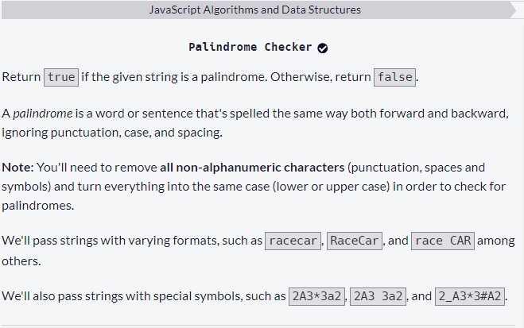

Para resolver dicho problema he creado el siguiente código:

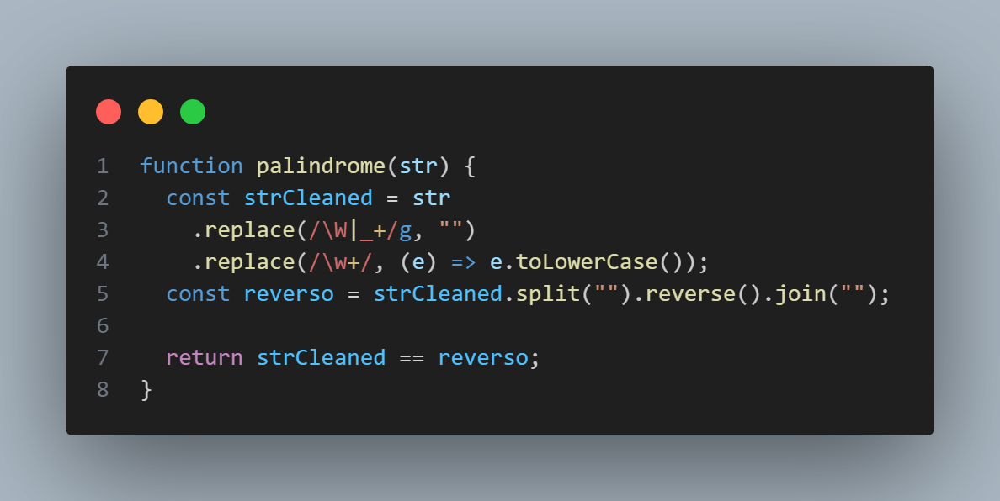

En primer lugar, realizo un reemplazo por un string vacío de todos los carácteres del tipo no word( carácteres no alfanuméricos ni guión bajo) junto con el guion bajo, recorriendo a lo largo de todo el string (flag g). Luego de realizado el reemplazo anterior, procedo a realizar el reemplazo de todas las letras, las cuales las detecto usando el metacarácter \w, por la misma letra pero en minúscula. Luego de que el string esta en minúscula y sin espacios ni caracteres especiales, procedo a invertir dicho string, usando el método split() con el separador igual a un string en blanco "" generándose un array, dicho array lo invierto y luego uno cada uno de sus elementos usando el carácter "" como carácter de unión. Para realizar la verificación de si el string ingresado es palindromo, comparo dicho string con el string generado en el paso anterior. Si son iguales entonces el string inicial es palindromo en base a los requisitos pedidos y si no lo es, entonces no es palindromo.

# 2. Roman Converter

Se plantea el siguiente problema:

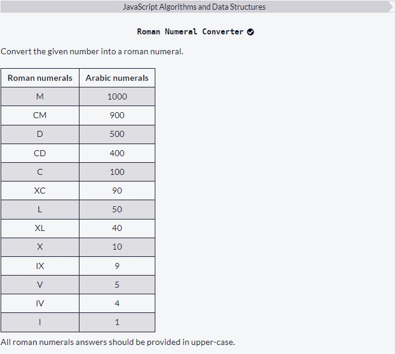

Mi código solución al problema es el siguiente:

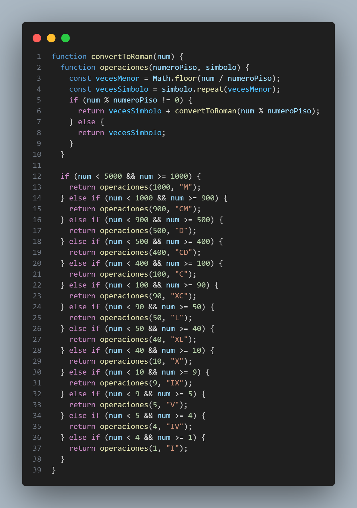

Como se puede observar mi código involucra recursividad. La tabla que se muestra cuando se plantea el problema señala una manera de resolver el problema de manera implícita. El algoritmo de resolución del problema es este: cuando el número a convertir a romano es menor que 5000 y mayor o igual que 1000, obtengo la división **entera** entre el número ingresado y la cota inferior del rango la cual es 1000. El resultado de división me indica cuántos simbolos romanos que representan a dicha cota debo utilizar y repetir. El resto de la división me genera un número menor que 1000 al cual le aplico la misma función pasándole el resto como argumento. Ahora, si el número es menor que 1000 y mayor o igual que 900, entonces realizo el mismo procedimiento que el caso anterior: realizo la división entera del argumento y la cota inferior que es 900, esto me indica cuántas veces debo repetir el símbolo romano de la cota inferior para ser añadidos al string que va concatenando símbolos romanos. El resto el cual es menor que 900 lo paso como argumento a la función de manera recursiva tal y como realicé en el caso anterior. Si se realiza este mismo procedimiento para cada cota de la tabla, se obtiene un string que es la concatenación de todos los símbolos romanos.

He creado la función llamada operaciones la cual me concentra el código que realiza la división y resto, dicha función posee como parámetros el número que es el piso y el símbolo romano que se va a repetir.

Mi código funciona para número menores que 5000 y se puede extender a números mayores que 5000 agregando los respectivos símbolos romanos.

# 3.Caesars Cipher

Se plantea el siguiente problema:

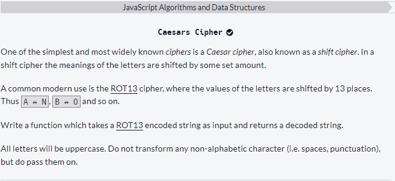

Mi código solución al problema es el siguiente:

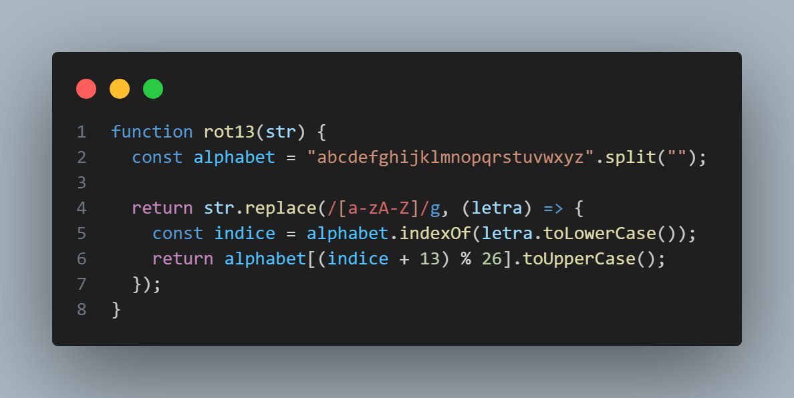

En palabras simples, se me pide que cada letra se desplace 13 posiciones en el abecedario y convertir esas letras a mayúsculas. En primer lugar, almaceno en una variable un array con el abecedario, siendo cada posición ocupada por una letra minúscula. Luego procedo a reemplazar cada letra del string dado como argumento de la función rot13, previa conversión de cada letra a minúscula, por la letra que es ocupada por la letra 13 posiciones más adelante en el abecedario. Si esta posición es mayor que el último índice del array, entonces realizo la operación módulo 26 de modo tal de generar la rotación. En el abecedario, la letra z esta en el índice 25 por lo que al obtener el módulo 26 se garantiza que siempre el índice estará entre 0 y 25. Luego procedo a retonar la letra de dicha nueva posición desplazada 13 lugares en mayúscula. Este retorno se encuentra dentro de la función callback aplicada como segundo argumento al método replace.

# 4.Telephone Number Validator

Se plantea el siguiente problema:

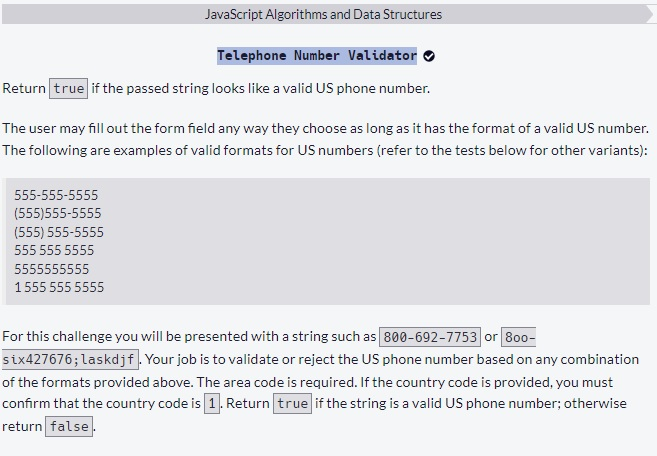

Mi código solución al problema es el siguiente:

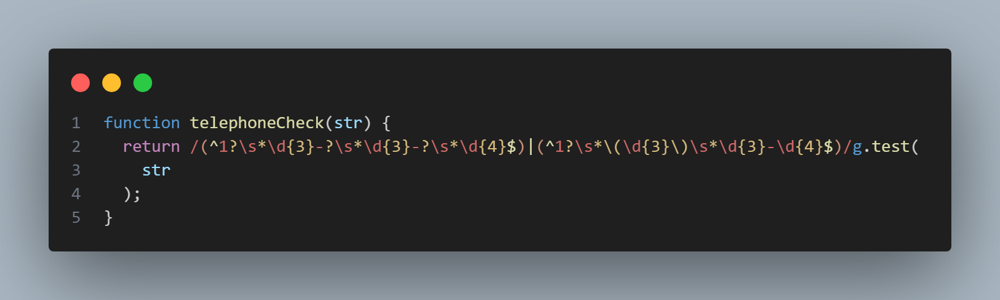

He creado una expresión regular que detecta todos los formatos ingresados de número de teléfono correctos. Dicha expresión regular es la siguiente:

`/(^1?\s*\d{3}-?\s*\d{3}-?\s*\d{4}$)|(^1?\s*\(\d{3}\)\s*\d{3}-\d{4}$)/`

Dicha expresión es una combinación de dos expresiones regulares unidas por el operador | (or lógico). La primera expresión regular (del lado izquierdo) es la siguiente:

`/(^1?\s*\d{3}-?\s*\d{3}-?\s*\d{4}$)/`

Dicha expresión detecta un string con el formato de:

-Al comienzo del string, un 1 que es opcional (0 ó 1 ocurrencia)

-Luego detecta espacios con 0 ó más ocurrencias

-Luego detecta 3 digitos seguido de un guión(-) de ocurrencia 0 ó 1

-Luego espacios con 0 ó más ocurrencias

-Luego 3 digitos luego un guión con 0 ó 1 ocurrencia

-Luego espacios con 0 ó más ocurrencias

-Luego 4 digitos al final del string

Dicha expresión regular detecta números como 1 555 555 5555 pero no detecta este número válido (555) 555-5555. Para detectar dicho tipo de número he creado esta otra expresión regular:

`/(^1?\s*\(\d{3}\)\s*\d{3}-\d{4}$)/`

Dicha expresión regular detecta un string con el formato de:

-Al comienzo del string, un 1 que es opcional (0 ó 1 ocurrencia)

-Luego detecta espacios con 0 ó más ocurrencias

-Luego detecta un carácter (

-Luego detecta 3 digitos

-Luego detecta un carácter )

-Luego detecta espacios con 0 ó más ocurrencias

-Luego detecta 3 digitos

-Luego detecta un guión

-Luego 4 digitos al final del string

Dicha expresión regular detecta números como (555) 555-5555. Para crear una expresión regular que combine ambas expresiones regulares es necesario concatenar ambas expresiones regulares por el operador | (or lógico en expresiones regulares).

# 5.Cash Register

Se plantea el siguiente problema:

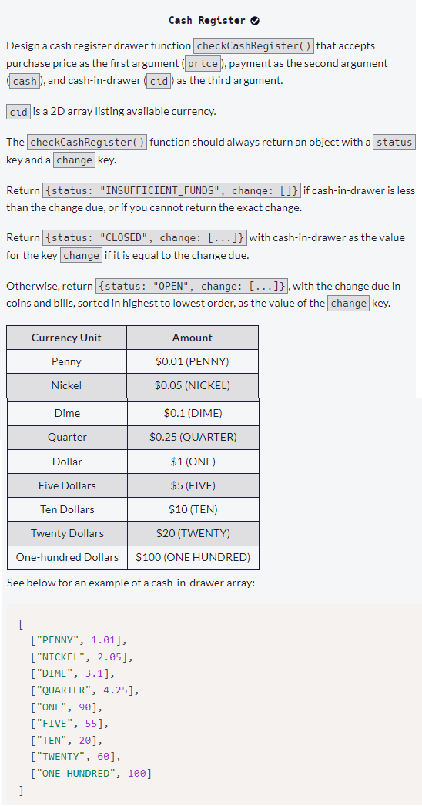

Mi código solución al problema es el siguiente:

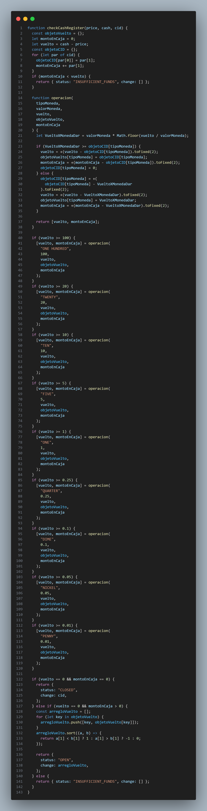

En palabras sencillas, el problema es el siguiente: usted tiene a la venta algo de precio **price** y un cliente le compra aquello pasandole cierto monto de dinero **cash**, se pide chequear si tiene los fondos suficientes para dar "vuelto" (cash due) previo al ingreso del dinero del cliente. Si no tiene los fondos suficientes debe retornar lo siguiente su programa:

`{ status: "INSUFFICIENT_FUNDS", change: [] }`

Si el "vuelto" que tiene que dar es, exactamente, el monto que tiene de fondos previo al ingreso del dinero del cliente entonces el programa debe retornar lo siguiente:

`{status: "CLOSED",change: Arreglo_con_el_dinero_en_caja};`

En lo anterior, donde he escrito Arreglo_con_el_dinero_en_caja, debe ir el arreglo del dinero en caja de cada tipo.

Si existen suficientes fondos de tal modo que después de generar el monto de "vuelto" (change due) aún le quedan fondos, entonces el programa debe retornar lo siguiente:

`{status: "OPEN", change: Arreglo_con_el_dinero_dado_de_vuelto}`

En lo anterior donde he escrito Arreglo_con_el_dinero_dado_de_vuelto debe ir el arreglo de subarreglos donde cada subarreglo contiene como primer elemento el tipo de moneda y el segundo elemento es la cantidad de dinero de ese tipo que se da como "vuelto".

El problema pide implementar la función **checkCashRegister** la cual posee tres parámetros:

-price: precio del producto o servicio

-cash: dinero pagado para comprar el producto o servicio

-cid: acrónimo de cash-in-drawer(dinero en caja). Arreglo de subarreglos donde cada subarreglo corresponde, en su primer índice, a un tipo de moneda y el segundo índice corresponde a la cantidad de dinero de ese tipo de moneda.

Lo que realiza mi código es lo siguiente:

-Convertir el arreglo cid a un objeto en el cual las keys corresponden al tipo de moneda y los values corresponden a la cantidad de ese tipo de moneda.

-Creación de la variable vuelto como diferencia entre **cash** y **price**

-Creación de la variable montoEnCaja la cual contiene el dinero total en caja

-Si el montoEnCaja es menor que el dinero a dar de vuelto, entonces retorno `{ status: "INSUFFICIENT_FUNDS", change: [] }` y se finaliza la función

-Si el montoEnCaja es igual que el dinero a dar de vuelto, entonces retorno `{status: "CLOSED",change: cid}`. Donde cid corresponde al tercer argumento dado a la función.

-Si el montoEnCaja es mayor que el dinero a dar de vuelto, entonces procedo a ir tomando de la caja el tipo de dinero desde su mayor denominación hacia el tipo de dinero de menor denominación. El primer tipo de dinero es **ONE HUNDRED**, si hay más dinero de ese tipo que lo que necesito de vuelto para dicho tipo de moneda (lo anterior lo calculo realizando una división entera entre el vuelto y la cuantia de ese tipo de moneda que es 100 en este caso para luego multiplicar el resultado de la división entera por la cuantia de ese tipo de moneda), entonces tomo solo lo que necesito restando de la variable vuelto lo que tome de la caja, actualizo el montoEnCaja y creo dicha clave en la variable objetoVuelto con la key **ONE HUNDRED** y el valor igual al monto que tome. Si hay menos dinero de ese tipo del que necesito para dar vuelto por ese tipo de dinero, entonces tomo **todo** el dinero de ese tipo de la caja restando de la variable vuelto todo el dinero de ese tipo de la caja, actualizo el montoEnCaja y creo dicha clave en la variable objetoVuelto con el valor igual a todo el dinero de ese tipo. Todo dicho código lo he almacenado en una función llamada operacion:

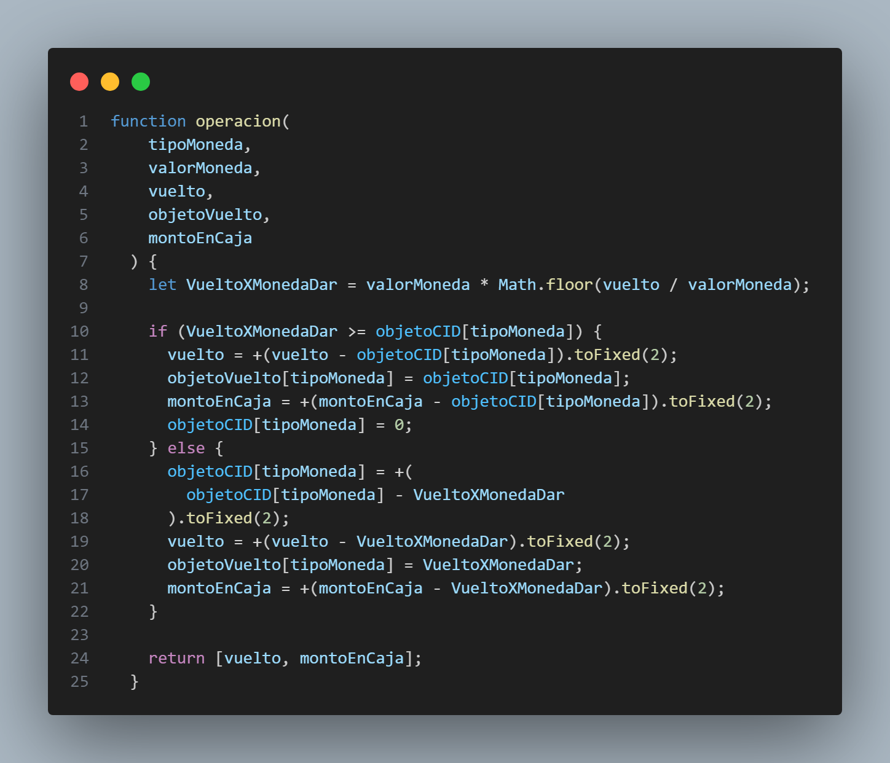

Dicha función **operacion** NO es una función pura ya que utiliza la variable objetoCID dentro de ella la cual es declarada fuera de la función y no es pasada como argumento. Esto es posible solucionarlo muy fácilmente creando un parámetro adicional en la función y pasar objetoCID como argumento para ese parámetro pero como dicha variable objetoCID es un objeto entonces la referencia es modificada dentro de la función sin necesidad de retornarla para reasignarla.

Ahora bien, en mi función operacion he usado el método `variable.toFixed(2)` el cual genera un string con el valor de variable redondeado a dos decimales. El motivo de usar ese redondeo es el error de aritmética de punto flotante el cual genera resultados imprecisos al realizar operaciones aritmeticas simples, por ejemplo, la resta de 96.74-60 me genera el número 36.739999999999995 y si utilizo dicho número en los cálculos, el error con dichas imprecisiones irá aumentando en cada operación. Al utilizar el método `variable.toFixed(2)` soluciono ese problema.

La función operacion retorna un arreglo con las variables locales vuelto y montoEnCaja que reasigno a las variables declaradas al principio de la función checkCashRegister: vuelto y montoEnCaja. Cada condicional if va actualizando las variables vuelto y montoEnCaja según cuánto dinero hay en caja para cada tipo de moneda que se verifica en el condicional. Al finalizar todo el proceso, si la variable vuelto es igual a 0 y el montoEnCaja es igual a 0, entonces se retorna `{status: "CLOSED",change: cid}`, es decir, todo la caja se dio como vuelto. Si la variable vuelto es igual a 0 y el montoEnCaja es mayor que 0, entonces quiere decir que aún queda dinero en la caja después de dar el vuelto al cliente. Debo retornar un arreglo de subarreglos en el cual cada subarreglo contiene en el primer índice el tipo de moneda y el segundo índice es el monto dado como vuelto de ese tipo de moneda ordenado en relación el valor de cada tipo de moneda. Dicho arreglo lo genero al recorrer la variable objetoVuelto para posterior ordenar dicho arreglo usando la función sort pasándole una función callback que permite ordenar de mayor a menor en base al valor del segundo índice de cada subarreglo. Si llegado a este punto la variable vuelto es mayor que 0 entonces NO se puede dar vuelto por el monto completo, entonces se retorna `{ status: "INSUFFICIENT_FUNDS", change: [] }`.
